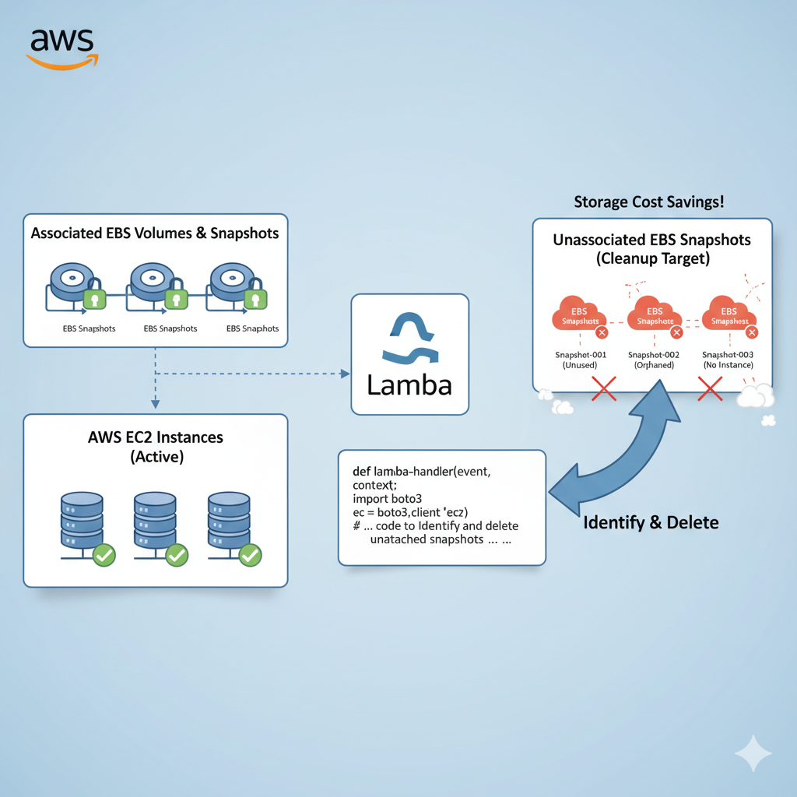

# AWS-CLOUD-COST-OPTIMISATION-PROJECT
# AWS Cloud Cost Optimization - Identifying Stale Resources and deleting them

## Identifying Stale EBS Snapshots

In this I created a Lambda function that identifies EBS snapshots that are no longer associated with any active EC2 instance and deletes them to save on storage costs.

### Description:

The Lambda function fetches all EBS snapshots owned by the same account ('self') and also retrieves a list of active EC2 instances (running and stopped). For each snapshot, it checks if the associated volume (if exists) is not associated with any active instance. If it finds a stale snapshot, it deletes it, effectively optimizing storage costs.

I also applied IAM roles and fine-grained policies to enforce least-privilege access, securing Lambda interactions with EBS and EventBridge.

Automated the scheduling of cleanup tasks through Amazon EventBridge rules, ensuring snapshots were managed without manual intervention.

.png>)

.png>)

.png>)

